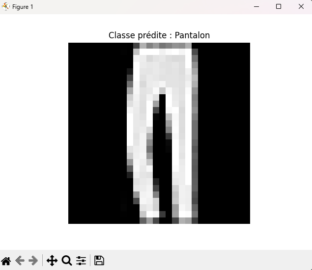

### 📁 `README.md`

````markdown
# 🧠 Classification de vêtements avec un réseau de neurones (Fashion MNIST)

Ce projet consiste à construire un modèle de réseau de neurones artificiels pour **classer automatiquement des vêtements** à partir d’images en niveaux de gris, en utilisant le jeu de données Fashion MNIST.

---

## 📌 Objectifs

- Concevoir un modèle d’apprentissage supervisé à l’aide de TensorFlow/Keras
- Utiliser **6 perceptrons (couches Dense)** dans l’architecture du réseau
- Classer 10 types de vêtements différents
- Afficher la **classe prédite** à partir d’une image choisie

---

## 🗂️ Structure du projet

- `code_modele.py` : script Python principal pour entraîner et tester le modèle
- `README.md` : ce fichier d’explication
- `enchantillion.png` : exemple d’image testée avec prédiction affichée

---

## 🔍 Description du modèle

Le modèle est un réseau **feed-forward** composé de :
- Une couche `Flatten` (mise à plat des images 28x28)
- 6 couches `Dense` (perceptrons) :
  - Dense(128, relu)
  - Dense(96, relu)
  - Dense(64, relu)
  - Dense(48, relu)
  - Dense(32, relu)
  - Dense(10, softmax)

---

## 📊 Jeu de données : Fashion MNIST

- 70 000 images 28x28 pixels (60 000 pour l’entraînement, 10 000 pour le test)
- 10 classes :
  - T-shirt/top
  - Pantalon
  - Pull
  - Robe
  - Manteau
  - Sandale
  - Chemise
  - Baskets
  - Sac
  - Bottines

---

## ▶️ Lancer le projet

### 1. Prérequis
```bash
pip install tensorflow matplotlib numpy
````

### 2. Exécution

```bash
python code_modele.py
```

---

## 🧪 Résultat attendu

Lorsque vous entrez un numéro d’image entre 0 et 9999, le programme affiche :

* L’image correspondante
* La classe prédite (ex : `Classe prédite : Pantalon`)

### Exemple :



---

## 👨‍💻 Auteur

Projet réalisé dans le cadre d’un apprentissage sur les réseaux de neurones et la classification d’images avec Python et TensorFlow.

---

## 📜 Licence

Ce projet est open-source et libre d’utilisation pour un usage éducatif.

